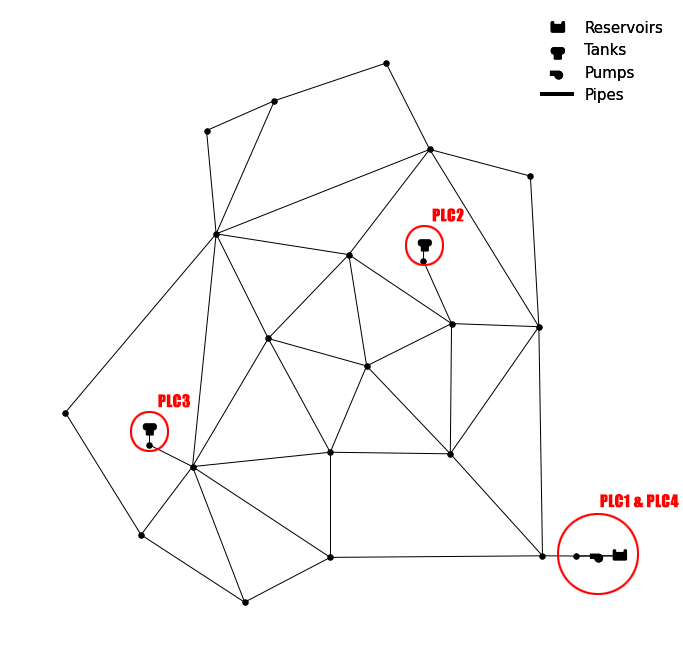

========
Examples
========

All examples will use the Anytown network, and the files used here are located in the ``Examples/examples`` folder from the root directory.

Network Graph of Anytown Showing PLCs

###############
Example 1 - DoS Attack
###############
Denial of service attacks have the capability of freezing a network, causing pumps to continue to pump water even when it has nowhere to go, or remain off when a tank is nearly empty. In WaCSim, a DoS attack be initiated in two different ways. Either the source PLC of the tag necessary for pumps to operate can be targeted so that they are unable to send data, or PLCs with pumps can be targeted to prevent them from receiving data. Below, both of these methods are covered in the following example attacks. 

``anytown_config.yaml``:

.. code-block:: yaml

   inp_file: anytown_map.inp
   output_path: output
   network_topology_type: complex
   iterations: 50
   plcs: !include anytown_plcs.yaml
   saving_interval: 1
   simulator: wntr
   demand: pdd
   attacks: !include anytown_dos_source.yaml
   #attacks: !include anytown_dos_destination.yaml
   demand_patterns: demands_anytown_small.csv
   
In the first attack, PLC2, which encompasses the T41 tank, is targeted with a DoS attack. Crucially, the ``direction`` parameter is set to ``source``, meaning that outbound packets are not forwarded and thus not received by PLC1 requesting T41 data. The attack is timed so that the status of P78 is off, causing tank T41 to continue draining.

``anytown_dos_source.yaml``:

.. code-block:: yaml

   network_attacks:
    - name: plc2DoS_source
      target: PLC2
      trigger:
        type: time
        start: 80
        end: 120
      type: simple_dos
      direction: source

In the second attack, PLC1, which encompasses the P78 pump, is targeted by a DoS attack. This time, the ``direction`` parameter is set to ``destination``, which causes all inbound packets from PLC2 to never be received. From a hydraulic perspective, this attack is identical to the previous but is done in a different way. 

``anytown_dos_destination.yaml``:

.. code-block:: yaml

   network_attacks:
    - name: plc1DoS_destination
      target: PLC1
      trigger:
        type: time
        start: 80
        end: 120
      type: simple_dos
      direction: destination
	  
Because both of these attacks have the same hydraulic outcome, analyzing the attack from a hydraulic perspective alone will not be able to pinpoint the source of the attack (though you can narrow it down.) However, on the cyber layer the two attacks are significantly different. Analysis of the .PCAP files, in addition to the hydraulic data, would allow one to pinpoint both that an attack is occurring as well as which PLC is being targeted. Additionally, only the attack on PLC2 will also stop communication to the SCADA as well, which would serve as another indicator of which attack is taking place.

###################################
Example 2 - Concealment MitM Attack
###################################
Man in the middle attacks (MitM) can be easily detectable by an operator monitoring a SCADA system if the attacker makes no attempt at concealing their activity. For example, if an attacker performs a MitM attacker on source packets coming from PLC2, then the SCADA will see the abnormal and modified values. The concealment options provided by WaCSim allow for more sophisticated attackers, who are able to hide their activity from the SCADA.

``anytown_config.yaml``:

.. code-block:: yaml

   inp_file: anytown_map.inp
   output_path: output
   network_topology_type: complex
   iterations: 50
   plcs: !include anytown_plcs.yaml
   saving_interval: 1
   noise: 0.2
   simulator: wntr
   demand: pdd
   attacks: !include anytown_concealment_mitm.yaml
   demand_patterns: demands_anytown_small.csv
   
In this attack PLC2, encompassing the T41 tank, is attacked so that PLC1 keeps the P78 pump off. However, before it does this attack, the attacker records the tag values of T41 that are outbound to the SCADA and PLC for 50 iterations. Then, after the recording period is complete, it begins the attack and replays the payload to the SCADA, masking its behavior. Additionally, the ``noise`` parameter is set to ``0.2``, adding some random variation to the values.

``anytown_concealment_mitm.yaml``:

.. code-block:: yaml

   network_attacks:
   - name: plc2attack
     type: concealment_mitm
     tags:
       - tag: T41
         value: 2
     target: PLC2
     concealment_data:
       type: payload_replay
       capture_start: 9
       capture_end: 59
       replay_start: 60
     trigger:
       type: time
       start: 10
       end: 100
	   
In this case, the SCADA will see that the P78 pump remains off despite receiving what appears to be normal T41 levels. From a purely hydraulic perspective, the operator would be unable to immediately tell if:

a) The P78 pump is malfunctioning.

b) The data coming from PLC1 is corrupted.

c) A device attack is occurring on the P78 pump.

d) A DoS attack on PLC1 is occurring.

e) A MitM attack is occurring on PLC1.

f) A concealment MitM attack is occurring on PLC2.

All these scenarios are plausible from a first glance of the issue. While a network analysis on just the connecting to the SCADA would be unable to detect the attack either, the tell-tale signs of an ARP poisoning attack would still be present. Furthermore, time-series analysis of the incoming T41 data might be able to determine that payloads are being replayed.
