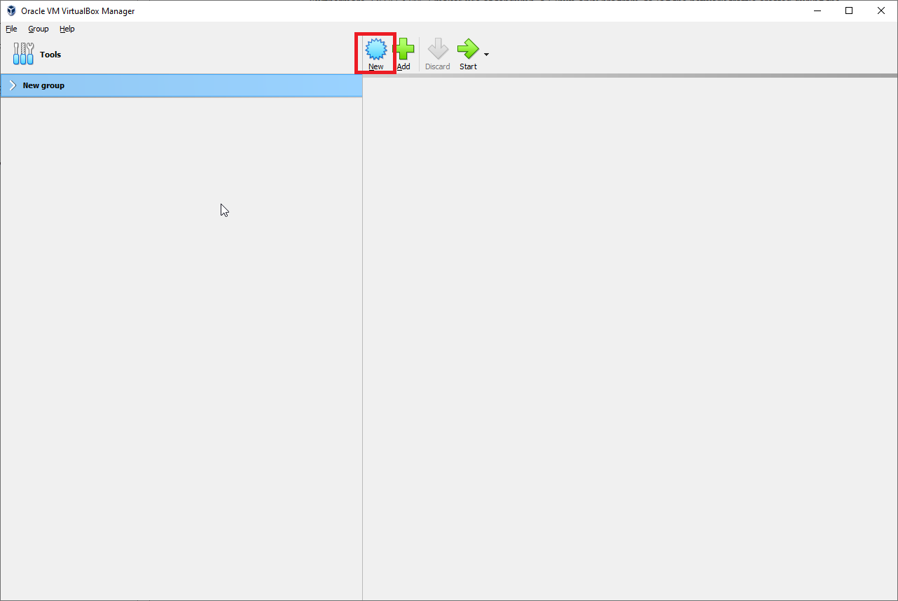
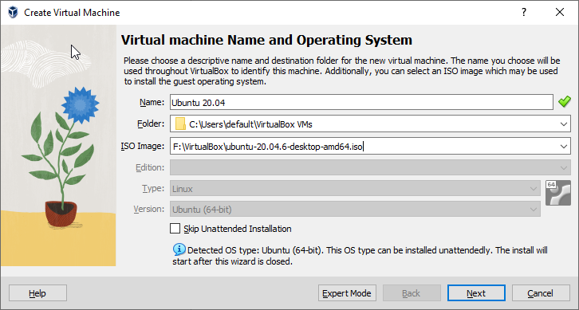

============
Installation
============
To run WaCSim a Linux machine is required. This is because Mininet, one of the dependencies of this package, utilizes Linux-specific features to create the virtual network that allows for
the network emulation side of WaCSim to work. Furthermore, WaCSim makes use of tcpdump, a Linux-only program, to log the network traffic created during the simulation. Here, a quick guide
on getting WaCSim running is provided for Non-Linux machines. If you are on a native Linux platform you can skip to step 4.

#########################################################
Step 1: Downloading & Installing VirtualBox (Non-Windows)
#########################################################
If on a Windows machine, the first thing to do is to set up a virtual machine. There are two primary options for virtual machine software: VMware and VirtualBox. Here, we will use
VirtualBox, as it is free and open source. However, if you have a VMware license you may use that instead, as it generally provides higher performance compared to VirtualBox (though it's use
will not be covered here.)

The page to download VirtualBox is `here`_. On the left, choose the platform you are on to download the installer. You do not need the VirtualBox Extension Pack that is on the right. Once the installer
has been downloaded, simply open it and go through the installation steps, keeping all default options.

################################
Step 2: Downloading Ubuntu 20.04
################################
WaCSim was originally tested on Ubuntu 20.04, and thus we continue to recommend Ubuntu 20.04 for WaCSim. Other versions of Linux might work, however there are no guarantees. To download the
desktop image (.ISO file) for Ubuntu 20.04, follow `this link`_ and select the "64-bit PC (AMD64) desktop image" option at the top right of the page. This will start the download for the image of
Ubuntu 20.04, and once done, you may move on to Step 3.

###############################
Step 3: Installing Ubuntu 20.04
###############################
Now, open up VirtualBox. Select the "New" icon.

Then, enter a name for the virtual machine (with no spaces), and point to where you want the virtual machine to be installed. Lastly, point to where the desktop image, the file downloaded in step 2, 
is located on your computer. This menu should look similar to the image below.

Now, hit next and choose a username or password, or leave it at its default settings. Then, move on to the hardware page. Here, you should select the amount of RAM and number of processers you want 
to give the virtual machine. The settings here depend on your machine, however any options in the green portions of the slider are okay. Similarly, on the next menu you can set the size of the virtual 
hard drive.  Finally, the summary page hit finish and Ubuntu will be installed.

**Important Note: If using Windows, ensure that both "Hyper-V" and "Virtual Machine Platform" are disabled otherwise the virtual machine will experience signifcant slowdowns. Once disabled, you must restart your machine first before continuing.**

###############################
Step 4: Installing WaCSim
###############################
To launch the newly installed Ubuntu virtual machine, simply double click on the main menu in VirtualBox. The default password, if you changed it, is "changeme". Once inside the virtual machine,
click on the files icon on the sidebar to the left of the desktop. Then, navigate to and create a folder for WaCSim (right click to create folders.) Then, right-click and select "Open in terminal" and
run the following commands inside the terminal.

.. code-block::
   
   git clone https://github.com/StavC/WaCSim
   
.. code-block::

   ./install.sh
   
Now, WaCSim has been installed. On the `Getting Started`_ page, instructions on how to get started with WaCSim are provided.

.. _`here`: https://www.virtualbox.org/wiki/Downloads
.. _`this link`: https://releases.ubuntu.com/focal/
.. _`Getting Started`: getting_started.rst
