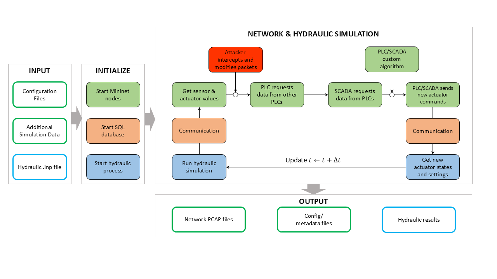

========
Overview
========
Today, many WDSs employ Supervisory Control and Data Acquisition (SCADA) systems, enabling remote monitoring and control of components, such as pumps or valves, in the network. 
SCADA necessitates the development of a Cyber-Physical system, and these Cyber-Physical systems increase the exposure to cyberattacks. Because of this, many systems are vulnerable
to cyberattacks (EPA 2024), which have the potential to disrupt operations, damage infrastructure, and harm the reputation of the operator. 

DHALSIM, originally developed by SUTD Critical Infrastructure Systems Lab, TU Delft Department of Water Management, CISPA, and iTrust, serves as a tool for simulating the cyber
communication between components in a WDS under the conditions of a cyberattack. It does this by co-simulating the hydraulic calculations of a water distribution system using `EPANET`_ and the network communication
using `minicps`_. These two separate simulations are connected via a database, with the network communication using the results from the hydraulic part, and the hydraulic
simulation taking actuator commands from the network part. Attackers are specified by the user, and will then interact with the other components in the WDS, manipulating the data they send and recieve.

More information on how these systems interact, and how the simulation is run can be found on the `Developing`_ page of the
original DHALSIM documentation.

DHALSIM-2 adds some key additions that enable more complex behavior in the model, as well as a few quality-of-life changes. Primarily, DHALSIM-2 enables the usage of custom logic
for determining what actions actuators in the system take. Beyond enabling behavior that can consider more information from the simulation, it also enables the testing of
defense mechanisms against attacks or detection algorithms. Other additions include improved stability, bug fixes, and PLC-level hydraulic data output.

DHALSIM-2 is capable of the following:

1. Emulate cyber communication between actuators, sensors, PLCs, and a central SCADA system.
2. Simulate attacker intrusion into network. 
3. Simulate cyberattacks such as Replay, Man in the Middle, and Denial of Service attacks.
4. Simulate packet loss events.
5. Allow complex PLC and SCADA behavior via user-made scripts.

This is not an exhaustive list of all that DHALSIM-2 is capable of. To learn more about DHALSIM-2's capabilities refer to the `Examples`_ and `Config Documentation`_ portions of the documentation.

References:

[1] Evans. (2024). Management Implication Report: Cybersecurity Concerns Related to Drinking Water Systems (Report No. 25-N-0004), EPA. 

.. _`EPANET`: https://www.epa.gov/water-research/epanet
.. _`minicps`: https://github.com/scy-phy/minicps?tab=readme-ov-file
.. _`developing`: https://github.com/Critical-Infrastructure-Systems-Lab/DHALSIM/blob/master/doc/developing.rst
.. _`Examples`: examples.rst
.. _`Config Documentation`: config_docs.rst
